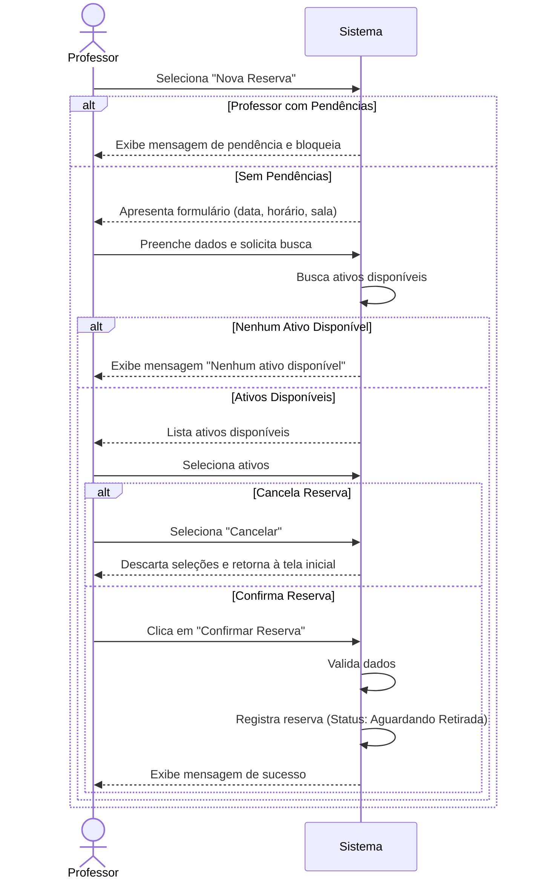

# CDU-01 — Solicitar Reserva

---

## 1. Histórico de Versões

| Data       | Versão  | Descrição                                            | Autor     |
| ---------- | ------- | ---------------------------------------------------- | --------- |
| 19/05/2026 | 1.0     | Criação inicial do CDU-01 - Solicitar Reserva        | Grupo CMD |
| 02/06/2026 | 1.1     | Atualização de formatação LAPIS e adição de diagrama | Grupo CMD |

---

## 2. Identificação do Caso de Uso

### 2.1 Nome

Solicitar Reserva

### 2.2 Objetivo

Permitir que o Professor solicite a reserva de ativos (projetores, cabos, chaves) para um determinado horário e sala.

### 2.3 Tipo

Concreto

---

## 3. Atores

### 3.1 Primário

Professor.

### 3.2 Secundários

Não se aplica.

---

## 4. Pré-condições

- O Professor deve estar logado no sistema.

---

## 5. Diagrama do Caso de Uso

---

## 6. Fluxo Principal (cenário de sucesso)

**P1.** O Professor seleciona a opção "Nova Reserva". **[E1]**

**P2.** O sistema apresenta o formulário com data, horário e sala.

**P3.** O Professor preenche os dados e solicita a busca de ativos disponíveis.

**P4.** O sistema lista os ativos disponíveis (projetores, chaves, cabos) para o período. **[E2]**

**P5.** O Professor seleciona os ativos desejados e clica em "Confirmar Reserva". **[A1]**

**P6.** O sistema valida os dados, registra a reserva com status "Aguardando Retirada" e exibe mensagem de sucesso.

**P7.** O caso de uso é encerrado.

---

## 7. Fluxos Alternativos

### A1. Cancelamento da Reserva

**A1.1** No passo **P5**, o Professor seleciona a opção "Cancelar".

**A1.2** O sistema descarta as seleções e retorna à tela inicial.

**A1.3** O caso de uso é encerrado.

---

## 8. Fluxos de Exceção

### E1. Professor com Pendências

**E1.1** No passo **P1**, o sistema identifica que o Professor possui devoluções em atraso.

**E1.2** O sistema exibe mensagem informando a pendência e bloqueia a nova reserva.

**E1.3** O caso de uso é encerrado.

---

### E2. Nenhum Ativo Disponível

**E2.1** No passo **P4**, o sistema não encontra ativos disponíveis para o período informado.

**E2.2** O sistema exibe mensagem "Nenhum ativo disponível" e permite que o Professor altere o horário ou data.

**E2.3** O sistema retorna ao passo **P2**.

---

## 9. Pós-condições

- Uma nova reserva é criada no sistema e vinculada ao Professor, aguardando a confirmação de retirada.

---

## 10. Requisitos Não Funcionais

Não se aplica.

---

## 11. Interface Visual

Não se aplica.

---

## 12. Frequência de Utilização

Alta.

---

## 13. Referências

- Documento de Visão da Demanda (VD F2.1)
