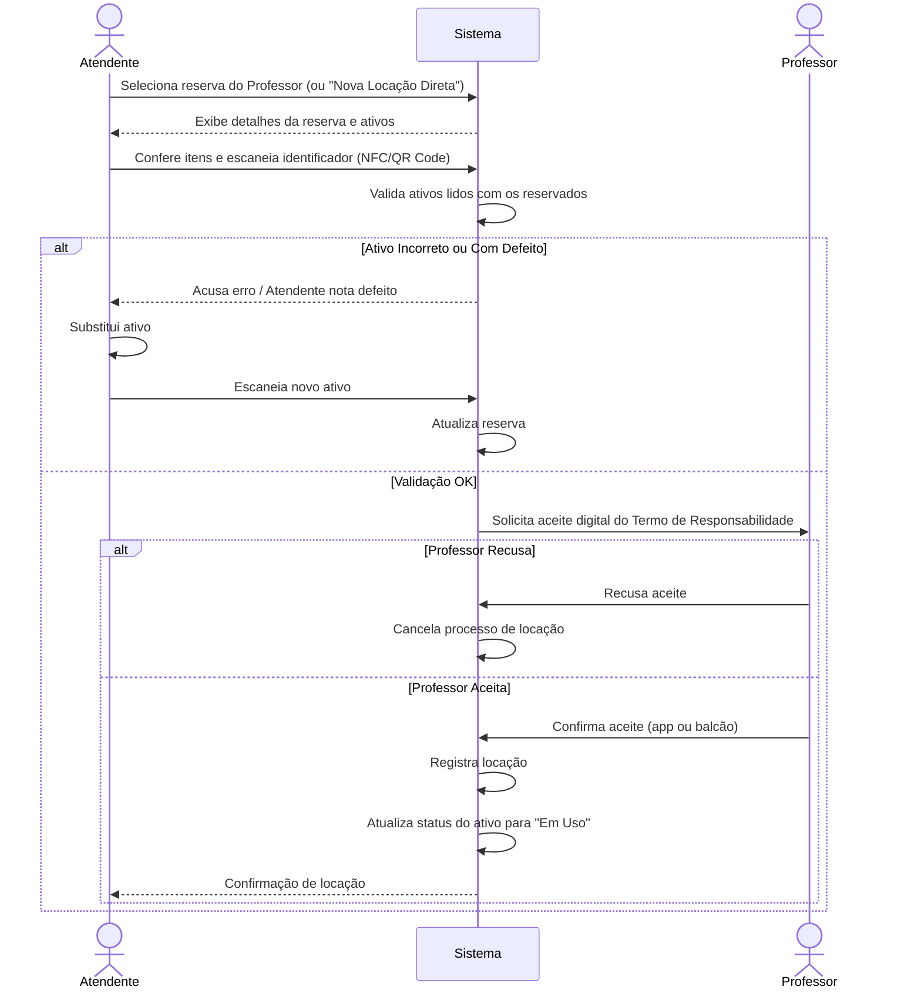

# CDU-02 — Confirmar Locação

---

## 1. Histórico de Versões

| Data       | Versão  | Descrição                                            | Autor     |
| ---------- | ------- | ---------------------------------------------------- | --------- |
| 19/05/2026 | 1.0     | Criação inicial do CDU-02 - Confirmar Locação        | Grupo CMD |
| 02/06/2026 | 1.1     | Atualização de formatação LAPIS e adição de diagrama | Grupo CMD |

---

## 2. Identificação do Caso de Uso

### 2.1 Nome

Confirmar Locação

### 2.2 Objetivo

Permitir que o Atendente confirme a entrega física dos ativos reservados ao Professor e registre o aceite do Termo de Responsabilidade.

### 2.3 Tipo

Concreto

---

## 3. Atores

### 3.1 Primário

Atendente.

### 3.2 Secundários

- Professor.

---

## 4. Pré-condições

- O Atendente deve estar logado no sistema.
- Deve existir uma reserva com status "Aguardando Retirada" (para o fluxo principal).

---

## 5. Diagrama do Caso de Uso

---

## 6. Fluxo Principal (cenário de sucesso)

**P1.** O Atendente seleciona a reserva do Professor no sistema. **[A1]**

**P2.** O sistema exibe os detalhes da reserva e os ativos solicitados.

**P3.** O Atendente realiza a conferência dos itens e escaneia o identificador físico (NFC/QR Code) de cada ativo.

**P4.** O sistema valida os ativos lidos com os reservados. **[E1]**

**P5.** O sistema solicita o aceite digital do Termo de Responsabilidade ao Professor.

**P6.** O Professor confirma o aceite digital pelo aplicativo ou assinatura no balcão. **[E2]**

**P7.** O sistema registra a locação, transfere a responsabilidade para o Professor e atualiza o status do ativo para "Em Uso".

**P8.** O caso de uso é encerrado.

---

## 7. Fluxos Alternativos

### A1. Locação Expressa (Sem Reserva Prévia)

**A1.1** No passo **P1**, o Atendente seleciona "Nova Locação Direta".

**A1.2** O Atendente seleciona o Professor e o sistema valida se o Professor possui pendências de devolução.

**A1.3** O Atendente escaneia os ativos.

**A1.4** O sistema segue para o passo **P5**.

---

## 8. Fluxos de Exceção

### E1. Ativo Incorreto ou Com Defeito

**E1.1** No passo **P4**, o sistema acusa erro na leitura do ativo ou o Atendente nota um defeito.

**E1.2** O Atendente substitui o ativo físico e escaneia o novo.

**E1.3** O sistema atualiza a reserva.

**E1.4** O sistema retorna ao passo **P3**.

---

### E2. Professor Recusa o Termo

**E2.1** No passo **P6**, o Professor recusa o aceite do termo.

**E2.2** O sistema cancela o processo de locação e os ativos não são entregues.

**E2.3** O caso de uso é encerrado.

---

## 9. Pós-condições

- O ativo é registrado como "Em Uso" e o Professor passa a ser o responsável físico pelo equipamento.

---

## 10. Requisitos Não Funcionais

Não se aplica.

---

## 11. Interface Visual

Não se aplica.

---

## 12. Frequência de Utilização

Alta.

---

## 13. Referências

- Documento de Visão da Demanda (VD F2.2)
