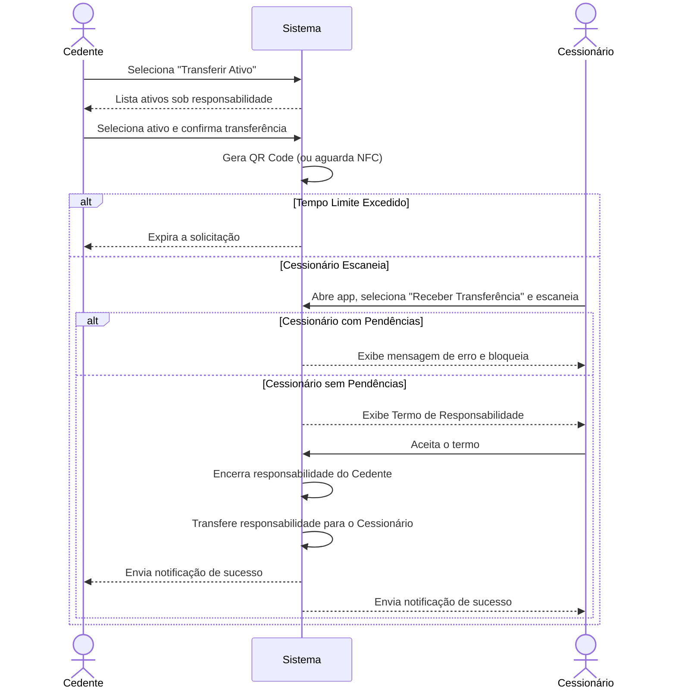

# CDU-03 — Transferir Ativo

---

## 1. Histórico de Versões

| Data       | Versão  | Descrição                                            | Autor     |
| ---------- | ------- | ---------------------------------------------------- | --------- |
| 19/05/2026 | 1.0     | Criação inicial do CDU-03 - Transferir Ativo         | Grupo CMD |
| 02/06/2026 | 1.1     | Atualização de formatação LAPIS e adição de diagrama | Grupo CMD |

---

## 2. Identificação do Caso de Uso

### 2.1 Nome

Transferir Ativo

### 2.2 Objetivo

Permitir a transferência direta da responsabilidade de um ativo de um Professor (Cedente) para outro Professor (Cessionário).

### 2.3 Tipo

Concreto

---

## 3. Atores

### 3.1 Primário

Professor (Cedente).

### 3.2 Secundários

- Professor (Cessionário).

---

## 4. Pré-condições

- Ambos os Professores devem possuir o aplicativo móvel com sessão ativa.
- O Professor Cedente deve ser o atual responsável pelo ativo.
- O Professor Cessionário não pode ter pendências ativas.

---

## 5. Diagrama do Caso de Uso

---

## 6. Fluxo Principal (cenário de sucesso)

**P1.** O Professor Cedente acessa o aplicativo e seleciona "Transferir Ativo".

**P2.** O sistema lista os ativos sob responsabilidade do Cedente.

**P3.** O Professor Cedente seleciona o ativo e confirma a intenção de transferência.

**P4.** O sistema gera um QR Code (ou aguarda aproximação NFC) no dispositivo do Cedente. **[E2]**

**P5.** O Professor Cessionário abre seu aplicativo, seleciona "Receber Transferência" e escaneia o ativo/dispositivo do Cedente. **[E1]**

**P6.** O sistema exibe o Termo de Responsabilidade para o Cessionário.

**P7.** O Professor Cessionário aceita o termo.

**P8.** O sistema encerra a responsabilidade do Cedente, transfere para o Cessionário e envia notificação de sucesso.

**P9.** O caso de uso é encerrado.

---

## 7. Fluxos Alternativos

Não se aplica.

---

## 8. Fluxos de Exceção

### E1. Cessionário com Pendências

**E1.1** No passo **P5**, após o escaneamento, o sistema identifica que o Cessionário possui devoluções em atraso.

**E1.2** O sistema exibe mensagem de erro e bloqueia a transferência.

**E1.3** O caso de uso é encerrado.

---

### E2. Tempo Limite Excedido

**E2.1** No passo **P4**, o Cessionário demora muito para escanear.

**E2.2** O sistema expira a solicitação e solicita que o Cedente inicie novamente.

**E2.3** O sistema retorna ao passo **P1**.

---

## 9. Pós-condições

- A responsabilidade pelo ativo é transferida oficialmente e o histórico de movimentação é registrado.

---

## 10. Requisitos Não Funcionais

- **Sincronização Offline:** O sistema deve suportar este fluxo offline e sincronizar assim que a conexão for reestabelecida.

---

## 11. Interface Visual

Não se aplica.

---

## 12. Frequência de Utilização

Baixa.

---

## 13. Referências

- Documento de Visão da Demanda (VD F2.3)
