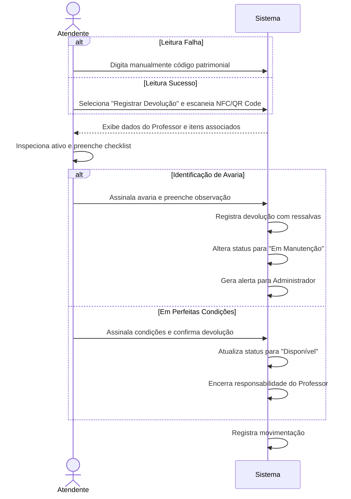

# CDU-04 — Registrar Devolução

---

## 1. Histórico de Versões

| Data       | Versão  | Descrição                                            | Autor     |
| ---------- | ------- | ---------------------------------------------------- | --------- |
| 19/05/2026 | 1.0     | Criação inicial do CDU-04 - Registrar Devolução      | Grupo CMD |
| 02/06/2026 | 1.1     | Atualização de formatação LAPIS e adição de diagrama | Grupo CMD |

---

## 2. Identificação do Caso de Uso

### 2.1 Nome

Registrar Devolução

### 2.2 Objetivo

Permitir que o Atendente registre o retorno de um ativo, finalize a responsabilidade do Professor e verifique a integridade do equipamento.

### 2.3 Tipo

Concreto

---

## 3. Atores

### 3.1 Primário

Atendente.

### 3.2 Secundários

- Professor.

---

## 4. Pré-condições

- O Atendente deve estar logado no sistema.
- O ativo deve estar com o status "Em Uso".

---

## 5. Diagrama do Caso de Uso

---

## 6. Fluxo Principal (cenário de sucesso)

**P1.** O Atendente seleciona a opção "Registrar Devolução" e escaneia o identificador físico (NFC/QR Code) do ativo. **[E2]**

**P2.** O sistema localiza o ativo e exibe os dados do Professor responsável e os itens associados.

**P3.** O Atendente inspeciona o ativo e preenche o checklist de integridade (cabos, funcionamento, avarias). **[E1]**

**P4.** O Atendente assinala que o ativo está em perfeitas condições e clica em "Confirmar Devolução".

**P5.** O sistema atualiza o status do ativo para "Disponível", encerra a responsabilidade do Professor e registra a movimentação.

**P6.** O caso de uso é encerrado.

---

## 7. Fluxos Alternativos

Não se aplica.

---

## 8. Fluxos de Exceção

### E1. Identificação de Avaria

**E1.1** No passo **P3**, o Atendente identifica uma avaria ou falta de componente.

**E1.2** O Atendente assinala a avaria no checklist e preenche a observação.

**E1.3** O sistema registra a devolução com ressalvas, altera o status do ativo para "Em Manutenção" e gera um alerta para o Administrador.

**E1.4** O sistema segue para o encerramento do caso de uso.

---

### E2. Leitura Falha do Identificador

**E2.1** No passo **P1**, o identificador NFC/QR Code está danificado.

**E2.2** O Atendente digita manualmente o código patrimonial.

**E2.3** O sistema segue para o passo **P2**.

---

## 9. Pós-condições

- O vínculo do Professor com o ativo é encerrado. O ativo volta a ficar "Disponível" ou entra "Em Manutenção".

---

## 10. Requisitos Não Funcionais

Não se aplica.

---

## 11. Interface Visual

Não se aplica.

---

## 12. Frequência de Utilização

Alta.

---

## 13. Referências

- Documento de Visão da Demanda (VD F3.1)
