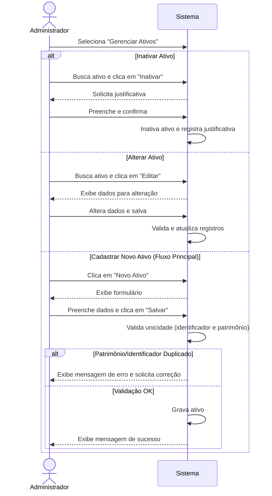

# CDU-05 — Gerenciar Ativos

---

## 1. Histórico de Versões

| Data       | Versão  | Descrição                                            | Autor     |
| ---------- | ------- | ---------------------------------------------------- | --------- |
| 19/05/2026 | 1.0     | Criação inicial do CDU-05 - Gerenciar Ativos         | Grupo CMD |
| 02/06/2026 | 1.1     | Atualização de formatação LAPIS e adição de diagrama | Grupo CMD |

---

## 2. Identificação do Caso de Uso

### 2.1 Nome

Gerenciar Ativos

### 2.2 Objetivo

Permitir que o Administrador mantenha o cadastro dos ativos do CCT (cadastrar, alterar, consultar e inativar).

### 2.3 Tipo

Concreto

---

## 3. Atores

### 3.1 Primário

Administrador.

### 3.2 Secundários

Não se aplica.

---

## 4. Pré-condições

- O Administrador deve estar logado no sistema com perfil adequado.

---

## 5. Diagrama do Caso de Uso

---

## 6. Fluxo Principal (Cadastrar Ativo)

**P1.** O Administrador seleciona a opção "Gerenciar Ativos" e clica em "Novo Ativo". **[A1] [A2]**

**P2.** O sistema exibe um formulário de cadastro.

**P3.** O Administrador preenche os dados: Número de patrimônio, Tipo de Ativo (Projetor, Cabo, Chave) e cadastra o Identificador Físico (Tag NFC/QR).

**P4.** O Administrador clica em "Salvar".

**P5.** O sistema valida a unicidade do identificador e do patrimônio. **[E1]**

**P6.** O sistema grava o ativo e exibe mensagem de sucesso.

**P7.** O caso de uso é encerrado.

---

## 7. Fluxos Alternativos

### A1. Inativar Ativo

**A1.1** No passo **P1**, o Administrador busca um ativo existente e clica em "Inativar".

**A1.2** O sistema solicita o preenchimento de uma justificativa (extravio, dano permanente, baixa).

**A1.3** O Administrador preenche e confirma.

**A1.4** O sistema inativa o ativo, registrando data, hora e justificativa.

**A1.5** O caso de uso é encerrado.

---

### A2. Alterar Ativo

**A2.1** No passo **P1**, o Administrador busca um ativo e clica em "Editar".

**A2.2** O sistema exibe os dados para alteração.

**A2.3** O Administrador altera os dados e salva.

**A2.4** O sistema valida e atualiza os registros (segue para o passo **P5**).

---

## 8. Fluxos de Exceção

### E1. Patrimônio ou Identificador Duplicado

**E1.1** No passo **P5**, o sistema identifica que o Número de Patrimônio ou Identificador Físico já está em uso por outro ativo.

**E1.2** O sistema exibe mensagem de erro e solicita correção.

**E1.3** O sistema retorna ao passo **P3**.

---

## 9. Pós-condições

- O inventário de ativos do sistema é atualizado.

---

## 10. Requisitos Não Funcionais

Não se aplica.

---

## 11. Interface Visual

Não se aplica.

---

## 12. Frequência de Utilização

Baixa.

---

## 13. Referências

- Documento de Visão da Demanda (VD F1.1 a F1.4)
