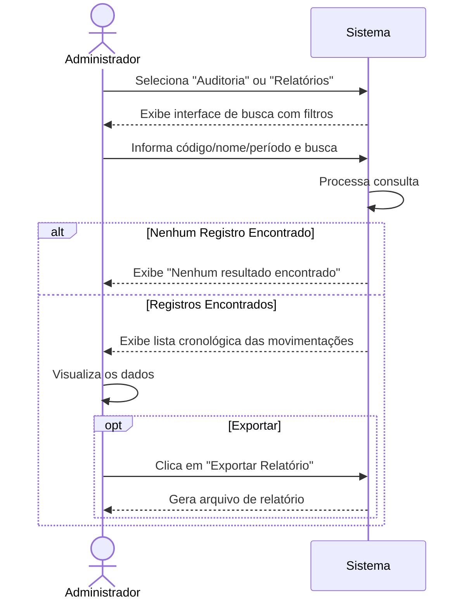

# CDU-06 — Auditar Movimentações

---

## 1. Histórico de Versões

| Data       | Versão  | Descrição                                            | Autor     |
| ---------- | ------- | ---------------------------------------------------- | --------- |
| 19/05/2026 | 1.0     | Criação inicial do CDU-06 - Auditar Movimentações    | Grupo CMD |
| 02/06/2026 | 1.1     | Atualização de formatação LAPIS e adição de diagrama | Grupo CMD |

---

## 2. Identificação do Caso de Uso

### 2.1 Nome

Auditar Movimentações

### 2.2 Objetivo

Permitir que o Administrador consulte o log completo de movimentações de um ativo ou usuário para fins de auditoria e responsabilização.

### 2.3 Tipo

Concreto

---

## 3. Atores

### 3.1 Primário

Administrador.

### 3.2 Secundários

Não se aplica.

---

## 4. Pré-condições

- O Administrador deve estar logado no sistema com perfil adequado.

---

## 5. Diagrama do Caso de Uso

---

## 6. Fluxo Principal (cenário de sucesso)

**P1.** O Administrador seleciona a opção "Auditoria" ou "Relatórios de Movimentação".

**P2.** O sistema exibe a interface de busca com filtros (Ativo, Professor, Período).

**P3.** O Administrador informa o código de um ativo ou nome de um Professor e clica em "Buscar".

**P4.** O sistema processa a consulta e exibe a lista cronológica das movimentações (quando locou, transferiu, devolveu e condição física no checklist). **[E1]**

**P5.** O Administrador visualiza os dados e, opcionalmente, clica em "Exportar Relatório".

**P6.** O caso de uso é encerrado.

---

## 7. Fluxos Alternativos

Não se aplica.

---

## 8. Fluxos de Exceção

### E1. Nenhum Registro Encontrado

**E1.1** No passo **P4**, o sistema não encontra movimentações para os filtros informados.

**E1.2** O sistema exibe a mensagem "Nenhum resultado encontrado" e permite nova pesquisa.

**E1.3** O sistema retorna ao passo **P2**.

---

## 9. Pós-condições

- Nenhuma modificação nos dados. Relatório gerado/visualizado.

---

## 10. Requisitos Não Funcionais

Não se aplica.

---

## 11. Interface Visual

Não se aplica.

---

## 12. Frequência de Utilização

Média.

---

## 13. Referências

- Documento de Visão da Demanda (VD F1.5, F2.4, F3.2)
