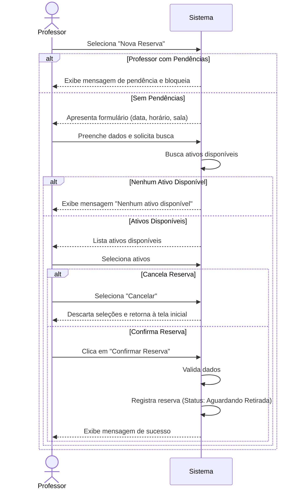
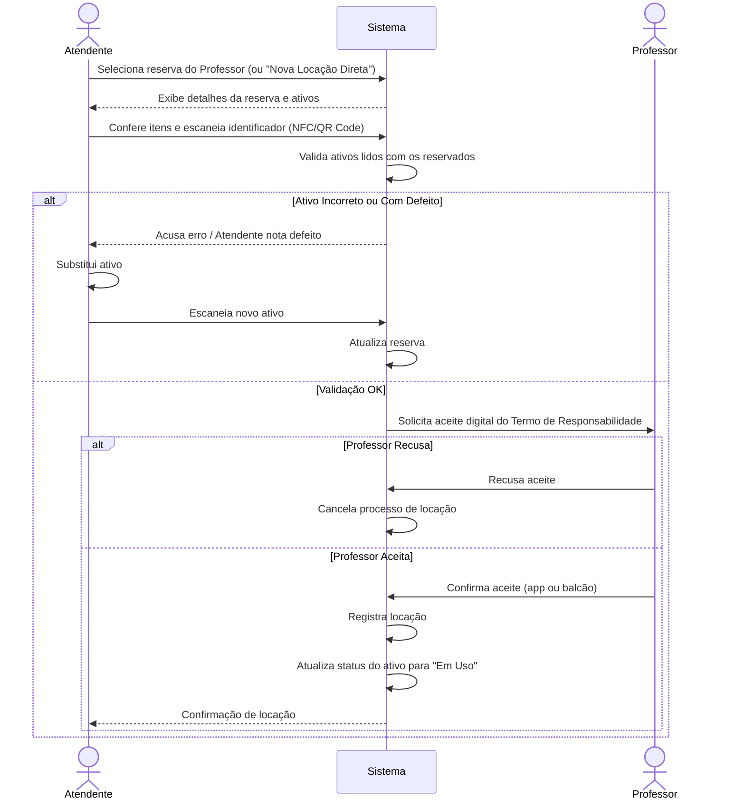
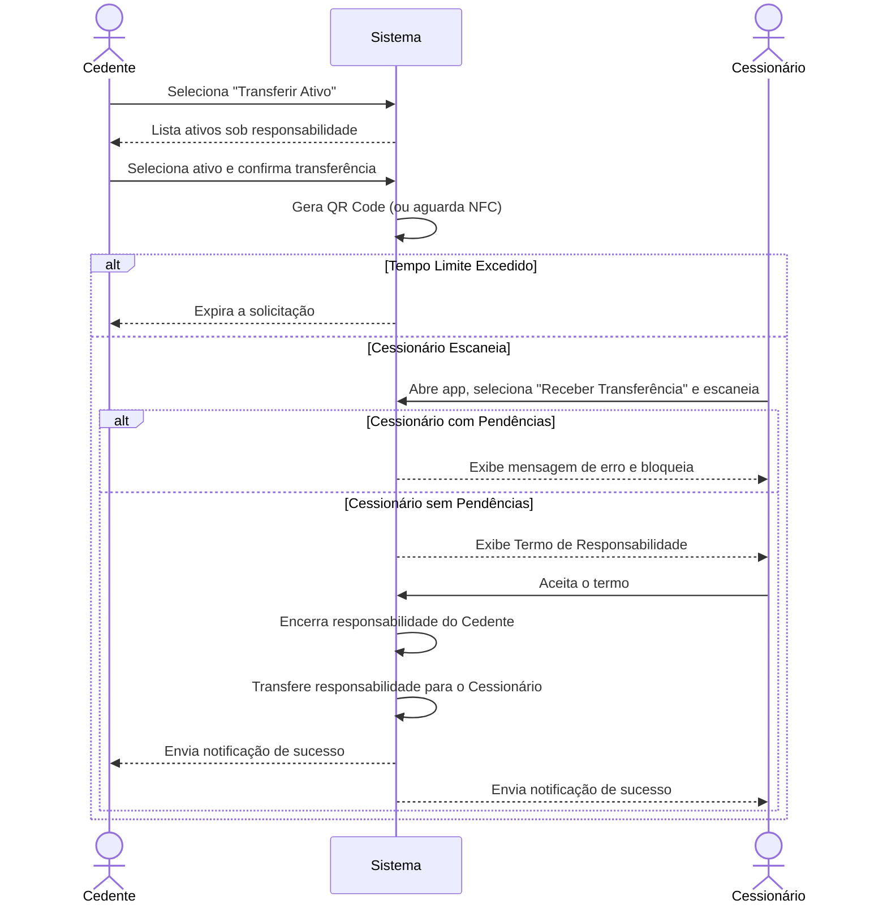
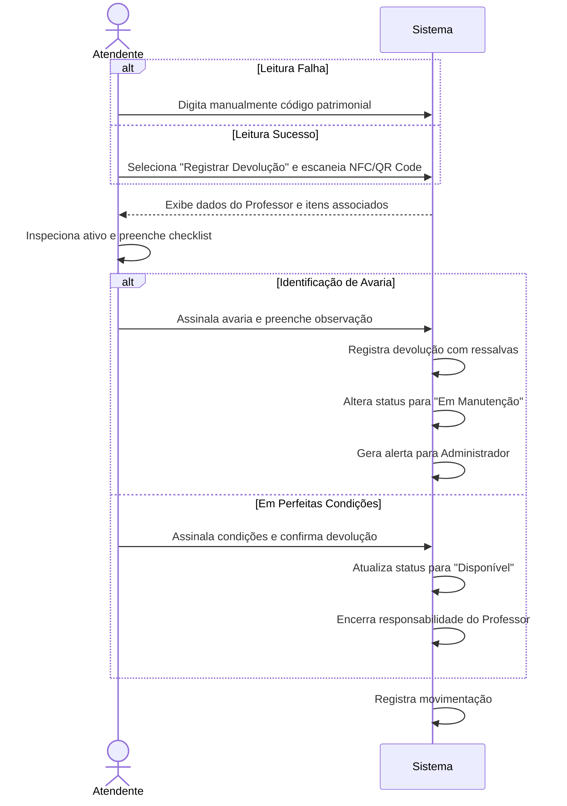
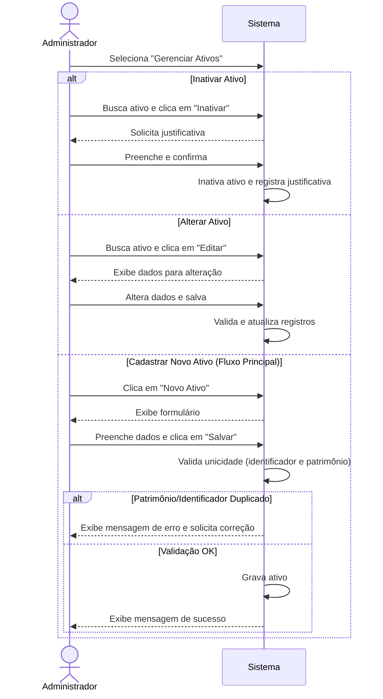
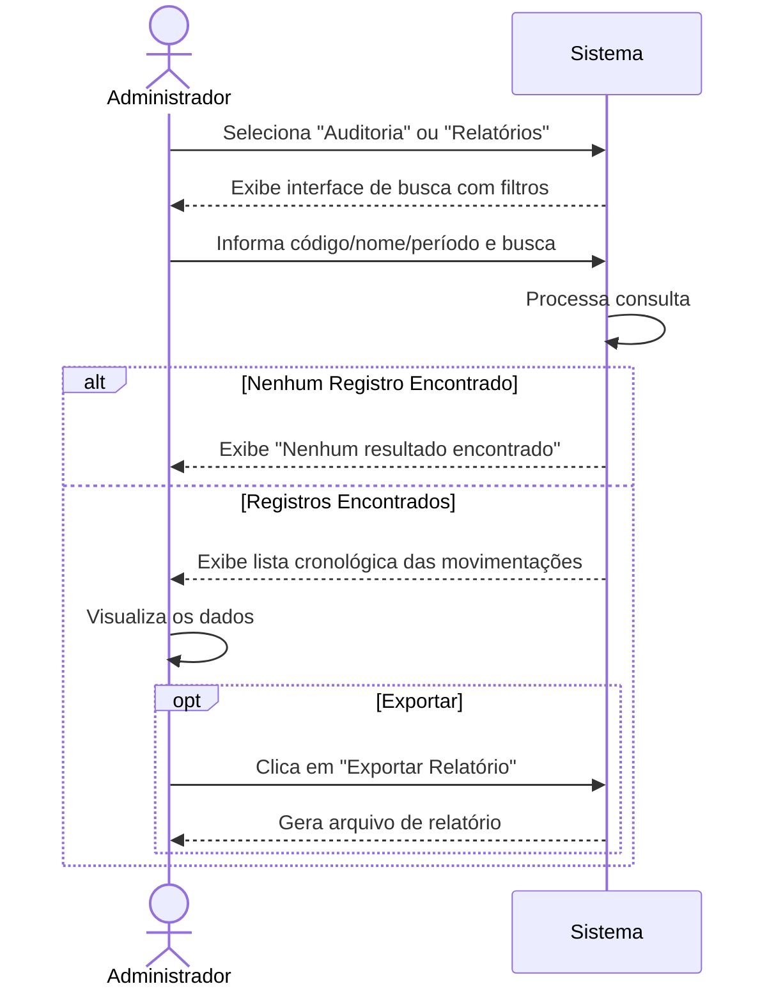

# Especificação de Requisitos de Software (SRS) - IEEE 830

## Sistema de Gestão de Ativos do CCT (GAC)

---

## 1. Introdução

### 1.1 Propósito

O propósito deste documento é definir a Especificação de Requisitos de Software (SRS) para o **Sistema de Gestão de Ativos (GAC)**, uma plataforma digital integrada a identificadores físicos (tags NFC e QR Codes) para apoiar e rastrear todo o ciclo de vida dos equipamentos do Centro de Ciências e Tecnologia (CCT) da Universidade de Fortaleza (Unifor).

### 1.2 Convenções do Documento

Os requisitos funcionais estão identificados pela sigla **RF** seguida de um número sequencial (ex: RF01, RF02).
Os requisitos não funcionais estão identificados pela sigla **RNF** seguida de um número sequencial (ex: RNF01, RNF02).

### 1.3 Público-Alvo e Sugestões de Leitura

Este documento destina-se a desenvolvedores, testadores, gerentes de projeto, Diretoria do CCT, Professores e Atendentes que usarão o sistema. Sugere-se a leitura sequencial para melhor compreensão do escopo e funcionalidades.

### 1.4 Escopo do Projeto

O Projeto GAC visa substituir os métodos de controle manuais por um sistema digital que traga confiabilidade tanto para o inventário quanto para as transações de empréstimo e devolução. O sistema permitirá:

* Digitalização do aceite dos Termos de Responsabilidade.
* Transferência oficial de equipamentos diretamente entre professores.
* Vínculo físico-digital seguro para cada equipamento.
* Controle preciso do ciclo de vida de ativos.
* Alertas automáticos para inconsistências operacionais.

### 1.5 Referências

* Documento de Visão da Demanda (VD)
* Especificação de Requisitos Funcionais (RF)
* Especificação de Requisitos Não Funcionais (RNF)
* Especificação de Regras de Negócio (RN)
* Protótipos de Alta Fidelidade — Google Stitch ([`assets/screens/`](../assets/screens/))

---

## 2. Descrição Geral

### 2.1 Perspectiva do Produto

O GAC transforma o controle manual (baseado em formulários de papel e planilhas) em um processo digital automatizado que gera histórico para auditoria e visibilidade em tempo real. O uso de hardware NFC/QR Code e um aplicativo móvel garantem agilidade na rotina de professores e atendentes.

### 2.2 Funções do Produto

As principais funções do produto englobam:

* Manutenção do cadastro de ativos (Projetores, Cabos e Chaves).
* Reserva ágil de ativos.
* Confirmação de locação com aceite de Termo Eletrônico.
* Transferência direta de ativos entre professores.
* Registro de devoluções com checklist de avarias.
* Auditoria completa do rastro de um ativo.
* Notificações de pendências e atrasos.

### 2.3 Classes e Características de Usuários

* **Professor:** Docente do CCT que precisa locar e devolver equipamentos. Requer agilidade entre os turnos.
* **Atendente:** Funcionário administrativo que valida as movimentações, registra avarias e realiza conferência dos itens.
* **Administrador:** Responsável pela gestão, cadastra os ativos, monitora o ciclo de vida e realiza auditorias.

### 2.4 Ambiente Operacional

* O aplicativo móvel será compatível com dispositivos **Android 9.0+** e **iOS 13+**, desenvolvido em **Flutter**.
* O painel administrativo web será desenvolvido em **Flutter Web**.
* O backend utilizará **Firebase** (Firestore, Authentication e Cloud Messaging) como plataforma BaaS.
* Utilização de leitores de **QR Code** ou sensores **NFC** para identificação dos equipamentos.
* Conectividade de rede não é obrigatória para operações de leitura e registro — o sistema suporta modo offline com sincronização automática.

### 2.5 Restrições de Design e Implementação

* O sistema deve sincronizar dados offline automaticamente em até 30 segundos após o restabelecimento da conexão.
* Priorização de registros do Atendente em casos de conflito de dados na sincronização.
* Exigência de leitura física (Tag NFC/QR Code) para transferências.

### 2.6 Suposições e Dependências

* A Unifor fornecerá as Tags NFC e etiquetas QR Code necessárias para a identificação de todos os ativos.
* Os professores possuirão dispositivos móveis compatíveis com o aplicativo para realizar o fluxo da aplicação.

---

## 3. Requisitos Específicos

### 3.1 Requisitos Funcionais

#### Necessidade 1: Gestão de Inventário

* **RF01 - Manter Cadastro de Ativos:** O sistema deve permitir ao Administrador cadastrar, consultar e alterar Projetores, Cabos e Chaves (com nº de patrimônio, Tipo, NFC/QR Code e Status).
* **RF02 - Inativar Ativo:** O sistema deve permitir inativar ativos (extravio, manutenção ou baixa) com justificativa textual.
* **RF03 - Consultar Histórico de Cadastro:** Disponibilizar log de alterações cadastrais para auditoria.

#### Necessidade 2: Operação de Locação e Posse

* **RF04 - Solicitar Reserva de Ativos:** O Professor deve poder selecionar e solicitar reserva para horários/salas específicas.
* **RF05 - Confirmar Locação:** O Atendente confirma a entrega validando pendências e coletando aceite digital do Termo de Responsabilidade.
* **RF06 - Transferir Ativo entre Professores:** Um Professor pode transferir um ativo diretamente para outro via leitura física da Tag NFC/QR Code.

#### Necessidade 3: Devolução e Auditoria

* **RF07 - Registrar Devolução de Ativo:** O Atendente registra a entrada com preenchimento de checklist de integridade e avarias.
* **RF08 - Auditar Movimentações:** O Administrador visualiza o rastro completo do ativo (locação, transferências e devoluções).

#### Necessidade 4: Notificações e Sistema

* **RF09 - Notificar Pendências e Atrasos:** Envio de alertas (Push/E-mail) sobre atrasos de ativos.
* **RF10 - Sincronizar Movimentações Offline:** Suporte a registro offline e upload automático ao detectar conexão.

### 3.2 Requisitos de Desempenho e Capacidade

* **RNF01 - Sincronização em Segundo Plano:** Sincronização automática em até 30 segundos após reconexão.
* **RNF02 - Usuários Simultâneos:** Suporte para até 200 usuários simultâneos no ambiente web.
* **RNF03 - Taxa de Transações Mobile:** Processar até 50 operações/minuto em horários de pico.
* **RNF05 - Backup Incrementais:** Backups do banco de dados a cada 4 horas.

### 3.3 Requisitos de Segurança

* **RNF06 - Autenticação Persistente:** Permite ao professor permanecer logado para acesso crítico offline.
* **RNF07 - Aceite de Termos:** Obrigatoriedade de aceite no Termo de Responsabilidade antes do primeiro uso.
* **RNF08 - Criptografia de Dados Locais:** Dados sensíveis em dispositivos móveis protegidos por criptografia de padrão industrial.

### 3.4 Requisitos de Confiabilidade

* **RNF04 - Integridade na Sincronização:** Em conflito, priorizar o registro do Atendente e gerar alerta ao Administrador.

### 3.5 Casos de Uso

#### CDU-01 — Solicitar Reserva

* **Objetivo:** Permitir que o Professor solicite a reserva de ativos para um determinado horário e sala.
* **Atores:** Professor.

#### CDU-02 — Confirmar Locação

* **Objetivo:** Permitir que o Atendente confirme a entrega física dos ativos reservados ao Professor e registre o aceite do Termo de Responsabilidade.
* **Atores:** Atendente (Primário), Professor (Secundário).

#### CDU-03 — Transferir Ativo

* **Objetivo:** Permitir a transferência direta da responsabilidade de um ativo de um Professor (Cedente) para outro Professor (Cessionário).
* **Atores:** Professor Cedente (Primário), Professor Cessionário (Secundário).

#### CDU-04 — Registrar Devolução

* **Objetivo:** Permitir que o Atendente registre o retorno de um ativo, finalize a responsabilidade do Professor e verifique a integridade do equipamento.
* **Atores:** Atendente (Primário), Professor (Secundário).

#### CDU-05 — Gerenciar Ativos

* **Objetivo:** Permitir que o Administrador mantenha o cadastro dos ativos do CCT (cadastrar, alterar, consultar e inativar).
* **Atores:** Administrador.

#### CDU-06 — Auditar Movimentações

* **Objetivo:** Permitir que o Administrador consulte o log completo de movimentações de um ativo ou usuário para fins de auditoria e responsabilização.
* **Atores:** Administrador.

